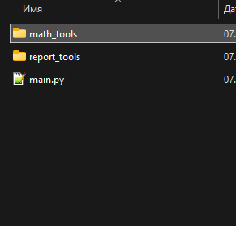
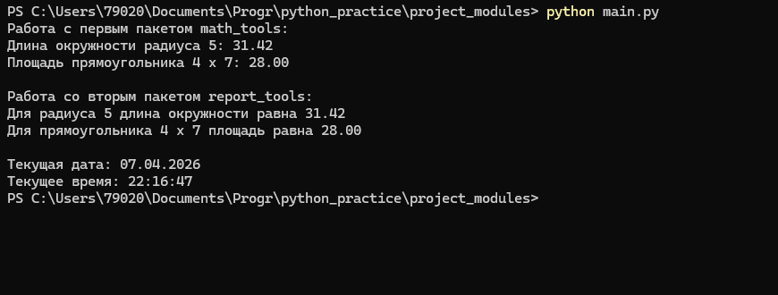

Cозданы два пакета: math_tools и report_tools.  
В пакете math_tools - математические функции.  
В пакете report_tools - функции для текстовых отчётов, он же импортирует math_tools и использует его функции.  
В файле main.py я импортированы оба пакета и вызваны функции из каждого.  
Применены f-строки для форматированного вывода результатов вычислений и для форматирования текущих даты и времени.  

--------

